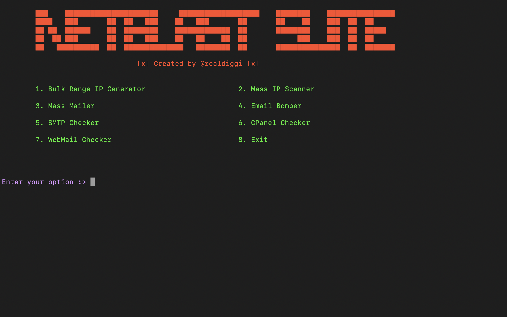

  <h1>NETBLASTER SUITE</h1>

> **note**
> I won't be held responsible for any wrongful use of this tool. It was made solely for educational purpose only.

### Menu Options

- Bulk Range IP address generator

  > This mod takes starting and ending IP addressses, then generates IPs within that range. You can also scan the IPs for given ports right after generating. Generated IPs will be saved to a file.

- Mass IP Scanner

  > It takes a list of IP addresses and scans for open ports and their running services. Results will be saved to a file.

- Mass Mailer

  > This takes a list of email address and sends a customized message to each. Message could either be plain or an html newsletter.

  > Implemented a workaround for gmail accounts to handle single connection limiting issues. This will also help prevent your account from getting banned or blocked. Daily limit still applies and the tool will terminate if detected.

- Email Bomber

  > Sends a number of emails to a single or multiple targets. The tool uses news content from newsapi.org so messages are dynamic.

  > Implemented a workaround for gmail accounts to handle single connection limiting issues. This will also help prevent your account from getting banned or blocked. Daily limit still applies and the tool will terminate if detected.

- SMTP Checker

  > This takes a mail access combolist and checks for valid SMTP credentials. A test email address has to be given by the user to send all valid SMTP credentials. This helps filter SMTPs with higher inbox rate.

- CPanel Checker

  > Checks for valid CPanel credentials from a given wordlist. Wordlist should be of the format https://example.com:2083|username|passwod. Valid credentials are saved to a file.

- Webmail Checker

  > Checks for valid Webmail credentials from a give wordlist. Wordlist should be of the format https://example.com:2096|username|password. Valid credentials are saved to a file.
